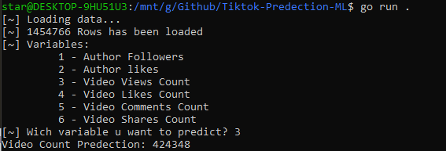

# Tiktok-Predection-ML

## Overview
a Simple machine learning algorithm, fully written in Go without using any 3rd Party Dependencies,
The goal of this algorithm is to predict any variable of the data.

## Input Data [video-input.json]
- Author Username (ignored and hidden)
- Author Followers
- Author likes
- Author Videos Count (ignored)
- Video Views Count
- Video Likes Count
- Video Comments Count
- Video Shares Count
- Video Duration (ignored)
- Video Created at (ignored)

## Output
The output of the algorithm is a predicted number of the choosen variable for the new tiktok video with the specified input. This prediction can be used to optimize a promotion or marketing videos on TikTok.

## Notice
the data in data.csv file is R3AL, 1.4M rows, scrapped in 1/May/2023 World Wide trending/explore, the usernames are HIDDEN, if u want a fresh data just tell me.